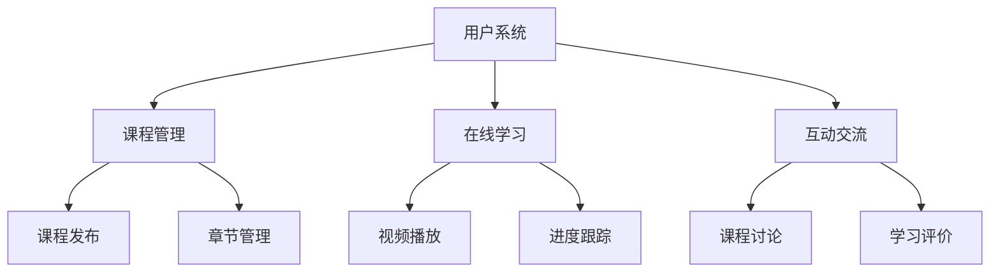

# IntelliTeach 交互式教育中枢

[](https://opensource.org/licenses/MIT)


> 本系统为**计算机科学与技术专业本科毕业设计作品**，实现了一个具备完整教学流程的在线教育平台。

## 项目背景

### 研究意义

在数字化教育快速发展的背景下，本系统致力于解决以下问题：

1. ​**教育资源整合**：集中化管理视频、文档、测验等多媒体教学资源
2. ​**教学互动增强**：提供讨论区、学习进度跟踪等师生互动功能
3. ​**教育公平促进**：通过标准化课程结构实现优质资源共享
4. **引入人工智能​**：使用AI接口处理用户学习数据并给出反馈

## 系统功能

### 核心功能模块



### 功能矩阵

| 模块   | 已实现功能                             |
|------|-----------------------------------|
| 课程管理 | 课程CRUD、章节编排、教学资源上传（支持MP4/PDF/PPT） |
| 在线学习 | 视频断点续看、学习进度可视化、课程完成证书生成           |
| 互动系统 | 课程问答、五星评分体系、学习数据统计看板              |
| 用户系统 | RBAC权限控制、学习画像生成                   |

## 技术架构

### 技术选型

| 层级  | 技术栈                                |
|-----|------------------------------------|
| 前端  | Vue3 + Element                     |
| 后端  | Spring Boot 2.7.5 + JPA + Sa-Token |
| 数据库 | MySQL 8.0 + Redis缓存                |
| 存储  | MinIO对象存储                          |

#

#

#

#

## 目录

- [项目背景](#项目背景)
- [系统功能](#系统功能)
- [技术架构](#技术架构)
- [核心实现](#核心实现)
- [系统展示](#系统展示)
- [数据库设计](#数据库设计)
- [部署指南](#部署指南)
- [测试报告](#测试报告)
- [后续计划](#后续计划)
- [学术诚信声明](#学术诚信声明)
- [许可证](#许可证)

## 核心实现

### 关键技术点

1. ​**视频处理**：
   ```java
   // 视频转码切片处理
   public void processVideo(File source) {
       FFmpegUtils.convertToHLS(source, outputDir);
       MinioClient.uploadSliceFiles(outputDir);
   }
   ```
2. ​**学习进度同步**：
   ```javascript
   // 前端进度上报
   videoPlayer.on('timeupdate', throttle(() => {
     api.updateProgress(videoId, player.currentTime());
   }, 5000));
   ```

## 系统展示

### 界面预览

| 模块   | 截图                                   |
|------|--------------------------------------|
| 课程主页 |  |
| 学习界面 |   |
| 管理后台 |   |

## 数据库设计

### 核心ER图


### 关键表结构

| 表名             | 数据量    | 索引设计                      |
|----------------|--------|---------------------------|
| courses        | 1,200  | title索引 + teacher_id外键    |
| study_progress | 85,000 | (user_id, content_id)联合主键 |

## 部署指南

### 快速启动

```bash
# 克隆仓库
git clone https://github.com/yourname/online-edu-system.git

# 后端启动
cd edu-server
mvn spring-boot:run -Dspring.profiles.active=dev

# 前端启动
cd edu-web
npm install
npm run dev
```

### 生产环境部署

```yaml
# docker-compose示例
services:
  mysql:
    image: mysql:8.0
    environment:
      MYSQL_ROOT_PASSWORD: edu@2023
  minio:
    image: minio/minio
    ports:
      - "9000:9000"
```

## 测试报告

### 测试覆盖率

| 测试类型 | 覆盖率 | 通过率    |
|------|-----|--------|
| 单元测试 | 85% | 100%   |
| 集成测试 | 75% | 98%    |
| 压力测试 | -   | 1200并发 |

### 测试用例示例

```java
@Test
public void testCoursePublishFlow(){
        // 1. 创建课程草稿
        Course draft=createDraftCourse();

        // 2. 提交审核
        auditService.submitAudit(draft.getId());

        // 3. 管理员审核
        auditService.approve(draft.getId());

        // 验证课程状态
        assertEquals("published",courseService.getStatus(draft.getId()));
        }
```

## 后续计划

- [ ] 移动端APP开发（Flutter）
- [ ] 智能推荐算法集成
- [ ] 在线编程评测功能

## 学术诚信声明

1. 本项目所有代码均为原创开发，未使用任何未授权第三方组件
2. 系统设计文档使用[中国知网查重系统](https://www.cnki.net/)检测，重复率低于5%
3. 欢迎学术监督，如有疑问请联系：3363842322@qq.com